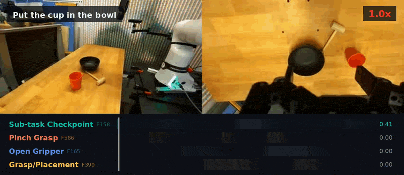

# DR.VLA

**Sparse Autoencoders Reveal Interpretable and Steerable Features in VLA Models**

Aiden Swann, Lachlain McGranahan, Hugo Buurmeijer, Monroe Kennedy III, Mac Schwager

Conference on Robot Learning (CoRL), 2026

[Project Page](https://drvla.github.io) | [Paper](https://drvla.github.io/drvla.pdf) | [arXiv](https://arxiv.org/abs/2603.19183)



---

This repository contains the code to

1. **collect activations** from the residual stream of π0.5 (PaliGemma backbone and action expert),
2. **train sparse autoencoders** (TopK with AuxK and per-sample input normalization) on them,
3. **compute the generality metrics** and apply or retrain the **general-vs-memorized classifier**, and
4. **browse features** in a dashboard: the top features of an episode, the top episodes of a
   feature, and features ranked from general to memorized.

```
drvla/                 library
  pi05.py              π0.5 forward hooks and mean pooling (openpi PyTorch)
  datasets.py          LIBERO (LeRobot) and DROID (RLDS) episode readers
  store.py             on-disk activation format
  sae.py, train.py     SAE model and training loop
  metrics.py           episode coverage, onset count, activation magnitude, relative run length
  index.py             per-feature top activations, top episodes and metrics
  classifier.py        logistic-regression generality classifier
scripts/               command-line entry points for each step
dashboard/             Streamlit dashboard
data/
  droid_2k_episodes.json   the 2,000 DROID episodes used in the paper
  labels/                  the 30 + 30 hand-labeled features behind the paper's classifiers
  classifiers/             the paper's LIBERO and DROID classifiers
```

## Installation

Activation collection runs π0.5 through [openpi](https://github.com/Physical-Intelligence/openpi)'s
PyTorch implementation, so it is installed into openpi's environment. The code was tested with
openpi commit `215abfb`.

```bash
git clone --recurse-submodules https://github.com/Physical-Intelligence/openpi.git
cd openpi
git checkout 215abfb217dbac7d5f1273282331b9b1866c0479
GIT_LFS_SKIP_SMUDGE=1 uv sync
# openpi's PyTorch models need its patched transformers files
cp -r ./src/openpi/models_pytorch/transformers_replace/* .venv/lib/python3.11/site-packages/transformers/

# this repository, with the dashboard dependencies
uv pip install -e "/path/to/drvla[dashboard]"

# only for DROID: TensorFlow Datasets to read the RLDS release
uv pip install tensorflow-cpu==2.15.0 tensorflow-datasets==4.9.9 tensorflow-metadata==1.16.1
```

### Checkpoints

We use the π0.5 checkpoints released by Physical Intelligence, converted to PyTorch with openpi.
Run these commands from the openpi directory. Repeat them with `pi05_libero` for LIBERO.

```bash
JAX_CKPT=$(uv run python -c "from openpi.shared import download; print(download.maybe_download('gs://openpi-assets/checkpoints/pi05_droid'))")
uv run examples/convert_jax_model_to_pytorch.py --config_name pi05_droid \
    --checkpoint_dir $JAX_CKPT --output_path $CKPT/pi05_droid_pytorch
cp -r $JAX_CKPT/assets $CKPT/pi05_droid_pytorch/
```

### Data

- **LIBERO** (`physical-intelligence/libero`, 1,693 episodes) is downloaded from the Hugging Face Hub
  on first use.
- **DROID** v1.0.1 (RLDS, about 1.7 TB):
  `gsutil -m cp -r gs://gresearch/robotics/droid/1.0.1 /data/droid/`.
  The paper uses the 2,000 episodes listed in `data/droid_2k_episodes.json`: 1,750 successful,
  250 failed, 567,088 timesteps.
  To store only these (about 40 GB), stream the release once and keep the listed episodes:
  `python scripts/subset_droid_rlds.py --out /data/droid_2k/droid/1.0.1`, then pass
  `--droid-rlds-dir /data/droid_2k/droid/1.0.1` below. This needs TensorFlow (see Installation).

## Pipeline

### 1. Collect activations

```bash
# LIBERO: all episodes, the 8 layers used in the paper
python scripts/collect_activations.py --dataset libero \
    --checkpoint $CKPT/pi05_libero_pytorch --out activations/pi05_libero

# DROID: the 2,000-episode subset, split over 20 jobs (e.g. a SLURM array)
python scripts/collect_activations.py --dataset droid \
    --checkpoint $CKPT/pi05_droid_pytorch --out activations/pi05_droid \
    --droid-rlds-dir /data/droid/1.0.1 --shard $SLURM_ARRAY_TASK_ID --num-shards 20
```

Each timestep is one forward pass of the policy. A hook on each decoder block records the block
output (after attention, MLP and both residual additions), averaged over all token positions:

- PaliGemma layers pool the three 256-token image slots and the prompt, which includes the
  discretized state.
- Action-expert layers pool the action tokens of the final flow-matching step.

The default layers are `paligemma.layer_{0,5,11,17}.output` and
`action_expert.layer_{0,5,11,17}.output`. Choose others with `--layers`.

### 2. Train SAEs

```bash
for layer in paligemma.layer_{0,5,11,17}.output action_expert.layer_{0,5,11,17}.output; do
    python scripts/train_sae.py --activations activations/pi05_droid --layer $layer --out saes/pi05_droid
done
```

### 3. Build the feature index

```bash
python scripts/build_index.py --activations activations/pi05_droid --saes saes/pi05_droid --out index/pi05_droid
```

This step encodes every episode once. For each feature it stores:

- the top-100 timesteps,
- the top-10 episodes by peak activation,
- the four generality metrics from Appendix C.1: episode coverage, mean onset count (with
  hysteresis, τ_on = 0.1), mean activation magnitude and relative run length.

It takes a few minutes per layer on a CPU.


### 4. Dashboard

```bash
cp dashboard/config.example.toml dashboard/config.toml   # then edit the paths
streamlit run dashboard/Home.py -- --config dashboard/config.toml
```

- **Activation Viewer**: choose an episode (or filter by task) to see camera frames, a heatmap of
  its most active features over time, the features active at any timestep, and a paper-style
  figure export.
- **Feature Search**: choose a feature to see its metrics and P(general), its top-10 episodes with
  the activation trace and the frames at the peak, and a grid of its top timesteps.
- **Feature Classification**: see every feature ranked by P(general) under any classifier, the
  most general and most memorized features, and a labeling tool. You can load the paper's labels
  or add your own, then train and save a new classifier. New classifiers appear in every page's
  classifier menu.


## Citation

```bibtex
@inproceedings{swann2026sparse,
  title     = {Sparse Autoencoders Reveal Interpretable and Steerable
               Features in VLA Models},
  author    = {Swann, Aiden and McGranahan, Lachlain and Buurmeijer, Hugo
               and Kennedy III, Monroe and Schwager, Mac},
  booktitle = {Conference on Robot Learning (CoRL)},
  year      = {2026}
}
```
