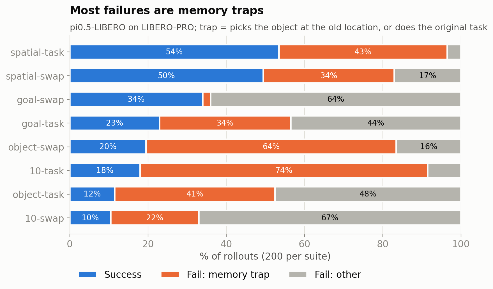
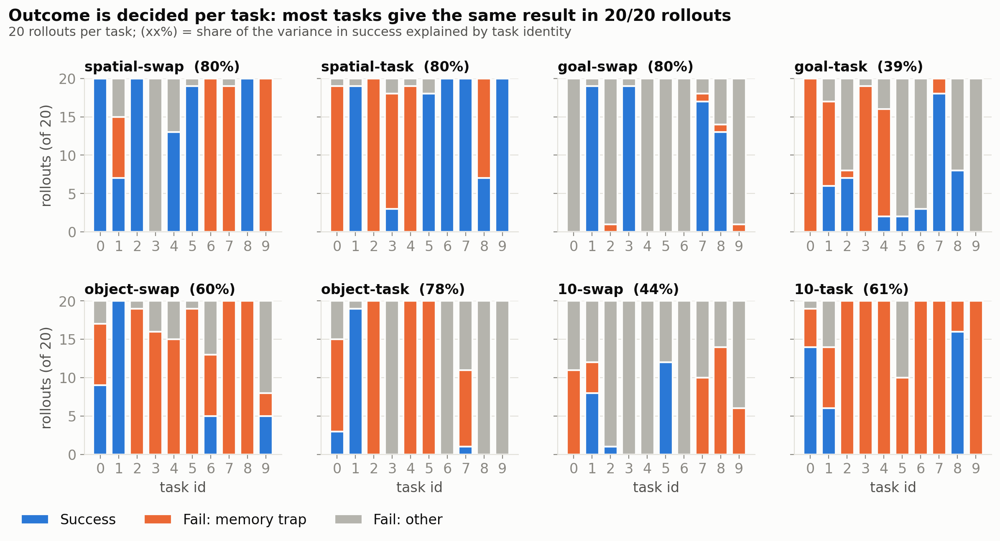
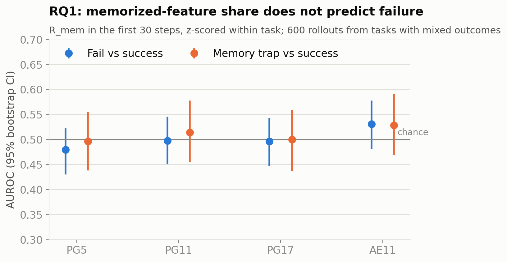
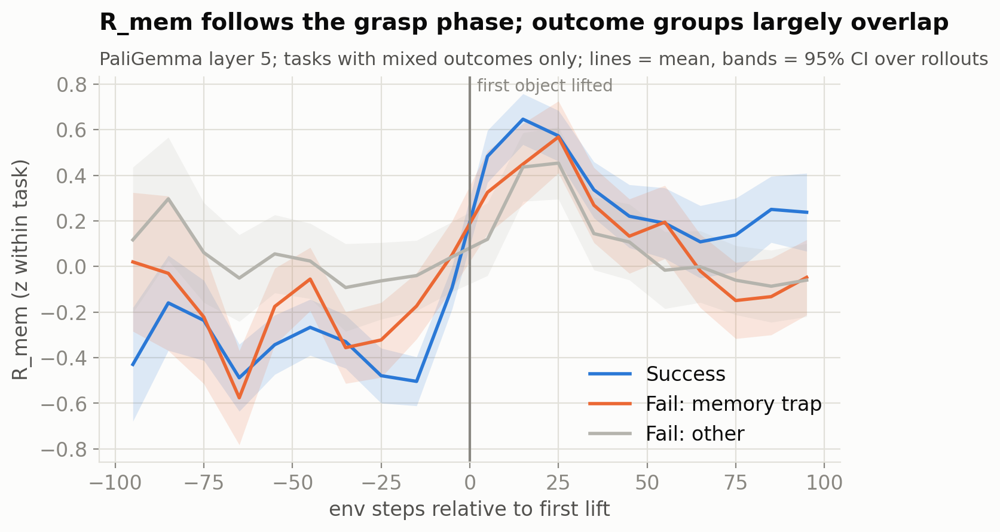
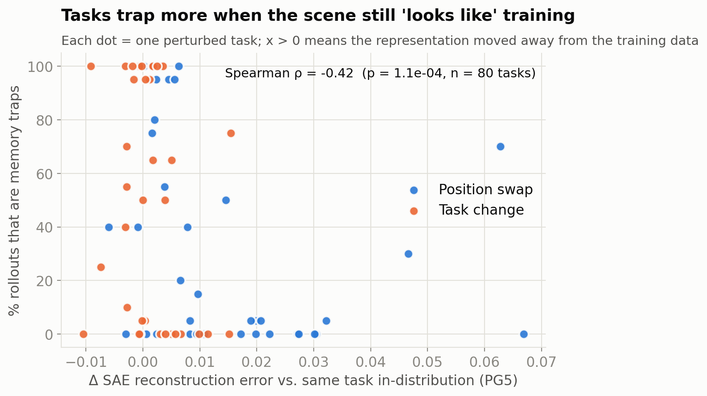
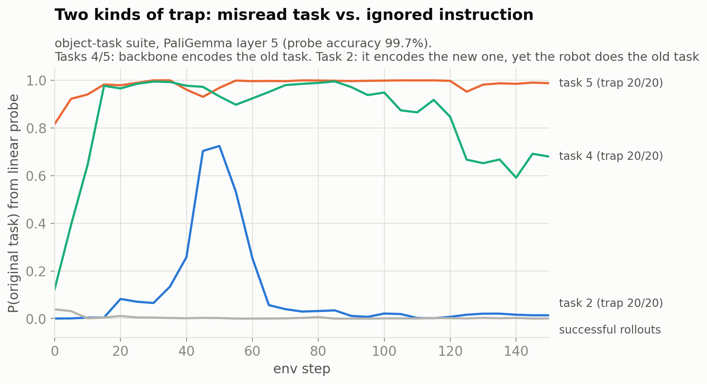
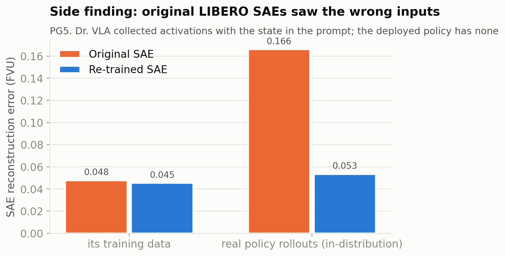
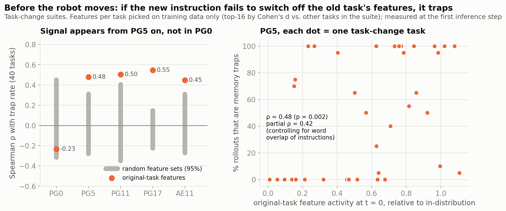

# RQ1: Failing rollouts có dựa nhiều hơn vào memorized features không?

*π0.5-LIBERO trên LIBERO-PRO, SAE của Dr. VLA. Phân tích lần 1, 08/10/2026.*

**Thiết lập:** 2.000 rollout có ghi log (4 suite gốc × 100 episode, 8 suite swap/task × 200 episode). Mỗi bước lưu activation 8 layer, action, và trạng thái simulator.

**Memory trap:** robot gắp vật ở **vị trí cũ** (swap), hoặc **làm lại task gốc** (task).

## TL;DR

| | |
|---|---|
| ❌ | Tỉ lệ feature "memorized" ($R_{mem}$) **không** dự đoán được fail (Fig. 3, 4) |
| ✅ | Memory trap là kiểu fail chủ đạo (Fig. 1) |
| ✅ | Outcome được quyết định ở cấp **task**, không phải cấp episode (Fig. 2) |
| 💡 | Task nào mà biểu diễn ít bị lệch khỏi dữ liệu train thì trap nhiều hơn (Fig. 5) |
| 💡 | Có hai kiểu trap: backbone đọc sai task, hoặc đọc đúng nhưng action bỏ qua (Fig. 6) |
| ⚠️ | SAE LIBERO gốc được train trên input khác với lúc deploy; đã sửa và train lại (Fig. 7) |
| ✅ | **Bước 2:** dùng feature *đặc trưng cho task* thay cho "memorized". Ở t = 0, task nào mà feature của task cũ vẫn bật thì trap nhiều hơn (ρ ≈ 0.5, Fig. 8) |

## 1. Memory trap là kiểu fail chủ đạo

- Trap chiếm 66–92% số lần fail ở object-swap, spatial-swap, spatial-task và 10-task.
- Số trap ở goal-swap thấp: nhiều vật bị đổi chỗ cùng lúc, nên bộ gán nhãn có thể bỏ sót.

## 2. Outcome được quyết định theo task

- Task giải thích 40–80% phương sai của success. Ở suite gốc con số này chỉ là 7–9%.
- Hệ quả: so sánh success với fail *trong cùng một task* có rất ít dữ liệu.

## 3. $R_{mem}$ không dự đoán được fail

- AUROC nằm quanh 0.5 ở mọi layer. $R_{mem}$ chủ yếu đi theo pha gắp, giống nhau ở mọi nhóm.
- Perturbation cũng **không** làm tăng $R_{mem}$.
- Lý do có thể: classifier xếp 98% feature PG5 vào loại "memorized", trong khi 2% feature "general" mang khoảng 45% activation. "Memorized" ở đây gần với *hiếm* hơn là *thứ policy dựa vào khi bị lừa*.

## 4. Hai tín hiệu cơ chế

- Mức tăng reconstruction error của SAE (so với cùng task ở bản ID) **tương quan âm với tỉ lệ trap**: ρ = −0.42, p < 0.001.
- Linear probe cho thấy hai cơ chế. Ở **task 4/5**, backbone mã hoá task cũ. Ở **task 2**, backbone mã hoá đúng task mới, nhưng robot vẫn làm task cũ, nên lỗi nằm ở phía sau backbone.
- ⚠️ Tín hiệu (b) mới dựa trên vài task, cần kiểm tra thêm.

## 5. Phát hiện phụ: lệch input

- Dr. VLA thu activation với state nằm trong prompt và ảnh xám ở slot camera bị mask. Policy khi deploy không có state trong prompt và dùng ảnh đen.
- Đã sửa bằng flag `--openpi-server-inputs` rồi train lại SAE (`*/pi05_libero_server`).

## 6. Bước 2: $\mathcal{M}$ mới = feature đặc trưng cho task

- **Cách chọn feature (chỉ dùng dữ liệu train):** với mỗi task, lấy 16 SAE feature tách task đó khỏi các task khác trong cùng suite tốt nhất (Cohen's d). Điểm $S_{orig}$ là mức bật của các feature thuộc *task gốc*, so với chính task đó ở bản ID.
- **Suite `_task`, đo ở t = 0 (trước khi robot di chuyển):** task nào mà câu lệnh mới không "tắt" được feature của task cũ thì trap nhiều hơn.
  - ρ = 0.45–0.55 ở PG5, PG11, PG17 và AE11, vững với K = 8/16/32.
  - Tập feature ngẫu nhiên cùng kích thước cho ρ ≈ 0.
  - Kết quả vẫn giữ sau khi kiểm soát độ giống nhau về chữ giữa hai câu lệnh (partial ρ = 0.42), và dương ở cả 4 suite.
- **PG0 không có tín hiệu.** Layout giữ nguyên nên phần thị giác thấy giống task cũ ở mọi task. Tín hiệu xuất hiện ở các layer nơi ngôn ngữ trộn vào biểu diễn.
- **Chưa có tín hiệu:** ở suite swap (vị trí đổi), và khi so trap với success *trong cùng một task* (AUROC 0.50–0.58, nằm trong khoảng của tập ngẫu nhiên).
- 98% số feature đặc trưng cho task bị classifier xếp vào "memorized". Classifier không tách được nhóm feature này, nên Finding 3 mới ra kết quả âm.

## Bước tiếp

1. **RQ2 (nhân quả).** Ở t = 0, giảm các feature của task cũ hoặc tăng các feature của task mới (ở PG5/PG11) trên những task trap 20/20, rồi xem robot có làm đúng task mới không. Đối chứng bằng tập feature ngẫu nhiên.
2. **Swap.** Feature theo task không bắt được memorization theo vị trí. Cần một tập khác, ví dụ feature mã hoá vị trí của vật mục tiêu (probe được từ log vị trí object trong rollout ID).
3. Dùng bộ dịch vị trí tăng dần `libero_object_temp_x0.1→0.5` để có biến thao tác bên trong mỗi task, sau khi đã có tập feature cho swap.

*Giới hạn:* chưa có attribution, mỗi cấu hình 1 seed, nhãn trap dựa trên hình học và chưa kiểm tra bằng video.

*Code:* `experiments/rq1/` (hình: `make_figures.py`). *Dữ liệu:* `workspace/rq1/analysis/`.
